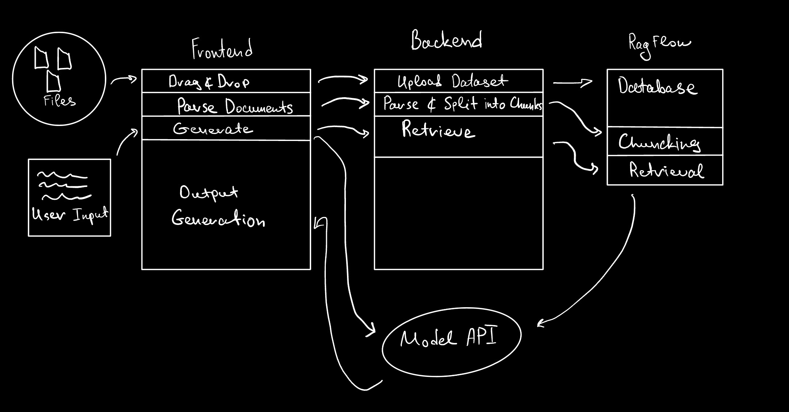
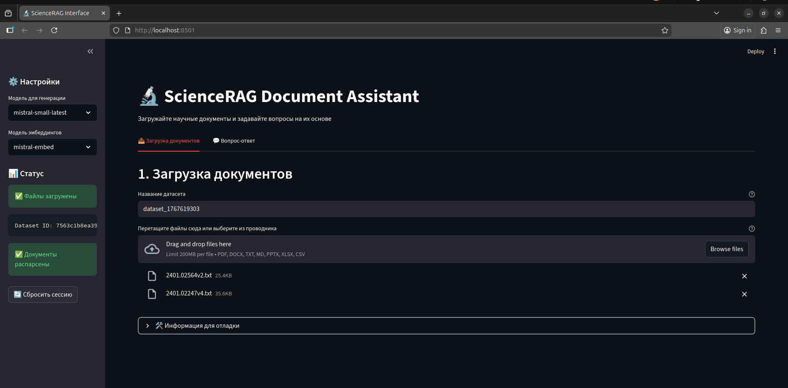
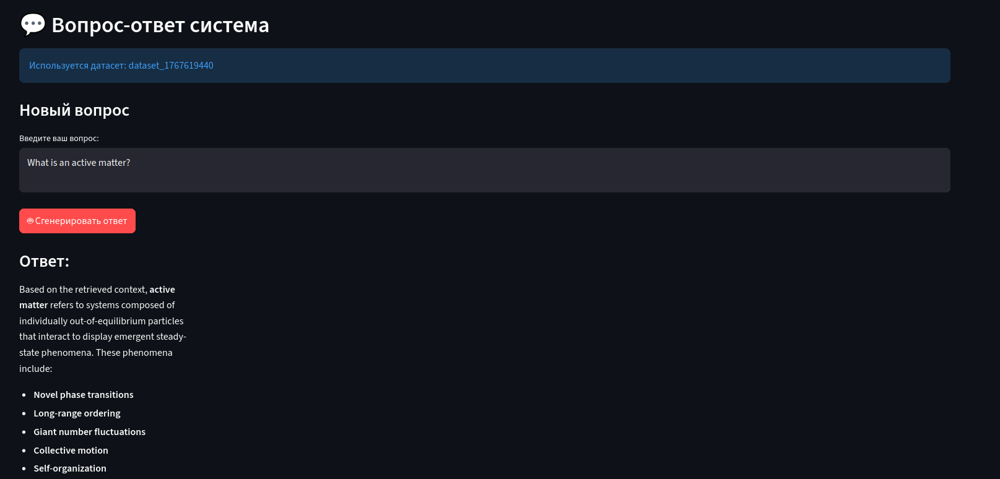
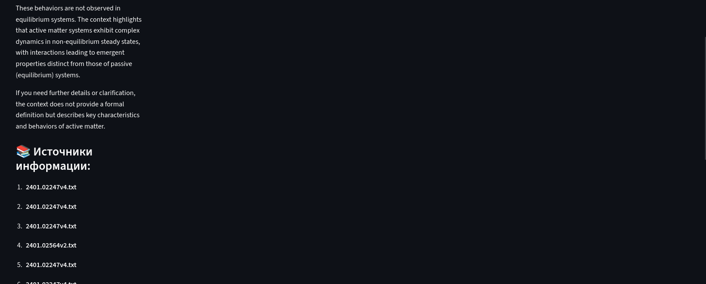

# ScienceRAG
## Ссылки
  [Архитектура](#архитектура)
  [Описание](#описание)
  [Запуск проекта](#запуск)
  [Тестирование](#тестирование)
  [Интерфейс](#интерфейс)
  [Артефакты](#артефакты)


## Архитектура



## Описание

Реализован простой раг пайплайн.

Загруженные документы рекурсивно разбиваются на чанки.

Во время этапа генерации модель ретривер забирает наиболее релевантные чанки.

После чего, на основе полученной информации, генерурется ответ на запрос пользователя

## Описание

## Запуск

### Шаг 1: Клонируем репозиторий и поднимаем Ragflow
Необходимо склонировать репозиторий проекта.
```
git clone https://github.com/3LayerPerceptron/ScienceRAG.git
```
Далее необходимо перейти в склонированную директорию и выполнить следующие команды
```
cd ./ragflow/docker/
```
```
docker compose up
```
RagFlow поднимается на локалхосте, необходимо перейти туда и выполнить следующие действия:

- Пройти Placeholder регистрацию.

- Во вкладке API выпустить себе API-ключ и добавить его в файл .env из папки App.

- Во вкладке Model Providers необходимо выбрать Эмбеддер и Генеративную модель. (Тестирование проводилось на моделях Mistral)

- Добавить API-ключ модели в App/.env и поменять baseurl в том же файле, если нужно.

### Шаг 2: Поднимаем Бэкенд
Из директории `./ragflow/docker` необходимо выполнить следующие команды:
```
cd ../..
```
```
docker build -f ./Docker/Dockerfile -t srag ./App
```
```
docker run -d -p 8025:8025 --network host --name srag srag
```

### Шаг 3: Поднимаем Фронтенд
```
python3 -m venv ./env
```
```
source env/bin/activate
```
```
pip3 install streamlit
```
```
streamlit run ./App/gui.py
```
!Если используется Mistral-embed, то запросы в модель необходимо слать на английском языке.

## Тестирование

Реализовано в ноутбуках `testing_rag.ipynb` и `testing_with_llm_as_judge.ipynb` на валидационной выборке.

Метрики retriever

| k | recall | precision | mrr   |
|---|--------|-----------|-------|
| 1 | 0.9375 | 0.9375    | 0.9375|
| 3 | 0.9896 | 0.3299    | 0.9635|
| 5 | 0.9896 | 0.1979    | 0.9635|

Метрики generation

| metric               | value |
|----------------------|-------|
| mean_correctness     | 0.53  |
| task_success_rate    | 0.22  |
| mean_faithfulness    | 0.424 |
| hallucination_rate   | 0.576 |

## Интерфейс
Страница загрузки датасета



Страница чата




## Артефакты

В директории Artefacts можно увидеть следующие артефакты разработки:

- Пример .env файлика
- Рисунок Архитектуры
- Скриншоты интерфейса
- Пример данных после предобработки (data sample)
- Примеры запросов в API через curl и python


